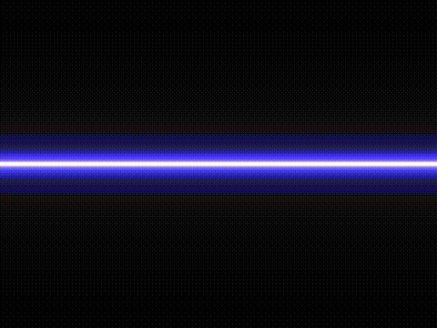

# Music Uptake Renderer Library - _Murl_

> Still a work in progress.

Murl is a simple, lightweight, cross-platform, modern, C++ implementation of
a music visualization application. 

<!-- put docs/visualizer.gif in the center -->

  

It is based on the following libraries:

- [OpenGL](https://www.opengl.org/) - Graphics and Shaders API
- [SDL2](https://www.libsdl.org/) - Windowing and Events
- [SDL2_mixer](https://www.libsdl.org/projects/SDL_mixer/) - Audio Playback
- [Emscripten](https://emscripten.org/) - WebAssembly Compilation

# Building and installing

See the [BUILDING](BUILDING.md) document.

# Contributing

See the [CONTRIBUTING](CONTRIBUTING.md) document.

# Licensing

[GPLv3](LICENSE)